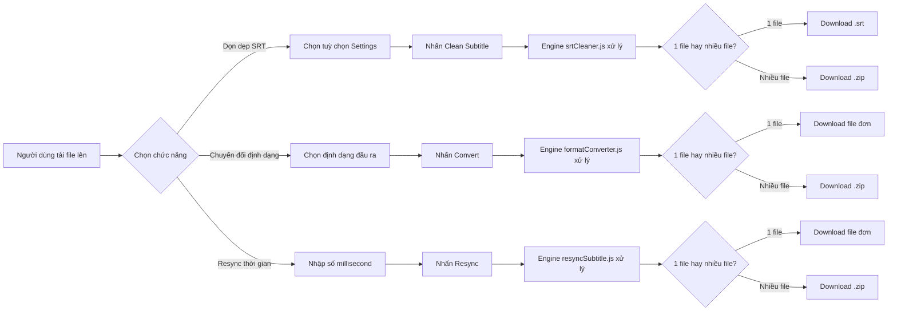

# 📄 Srt Cleaner — Tổng quan dự án (Overview)

## 1. Giới thiệu

**Srt Cleaner** là một ứng dụng web miễn phí, xử lý hoàn toàn trên trình duyệt (client-side), giúp người dùng dọn dẹp và chuyển đổi định dạng tập tin phụ đề. Không có bất kỳ dữ liệu nào được gửi lên máy chủ — đảm bảo bảo mật tuyệt đối.

- **URL Production:** Triển khai trên Netlify (Static Site)
- **Công nghệ:** Vite + React 19 + Vanilla CSS
- **Ngôn ngữ giao diện:** Tiếng Anh (phần chức năng) + Tiếng Việt (hướng dẫn sử dụng / FAQ)

---

## 2. Chức năng chính

### 2.1 Dọn dẹp phụ đề (SRT Cleaner)
Cho phép người dùng tải lên một hoặc nhiều tập tin `.srt`, chọn các tuỳ chọn dọn dẹp, xử lý và tải file kết quả về máy.

| Nhóm | Tuỳ chọn |
|------|----------|
| **Options** | Remove SDH, Remove watermarks, Remove speaker labels, Remove cues chứa ♪, Remove line breaks, Merge cues trùng, Chuyển HOA → thường |
| **Remove text formatting** | Xoá thẻ HTML (giữ lại `<i>`, `<b>`, `<font>` tuỳ chọn), Xoá mọi thứ trong `< >` |
| **Remove between** | Xoá nội dung giữa `{ }`, `( )`, `[ ]`, `* *`, `# #` |

- Hỗ trợ **tải lên nhiều file** cùng lúc (kéo thả hoặc chọn).
- Khi xử lý nhiều file, tự động nén thành **`.zip`** để tải về.

### 2.2 Chuyển đổi định dạng phụ đề (Format Converter)
Chuyển đổi qua lại giữa 4 định dạng phổ biến:

| Định dạng | Mô tả |
|-----------|-------|
| `.srt` | SubRip — phổ biến nhất |
| `.vtt` | WebVTT — dùng cho trình duyệt / HTML5 |
| `.ass` | Advanced SubStation Alpha — hỗ trợ định dạng phức tạp |
| `.sub` | MicroDVD — định dạng dựa trên frame |

- Tự động nhận diện định dạng đầu vào.
- Hỗ trợ chuyển đổi hàng loạt + tải `.zip`.

### 2.3 Đồng bộ lại thời gian phụ đề (Resync Subtitles)
Dịch chuyển toàn bộ timestamp của file phụ đề theo số millisecond do người dùng chỉ định.

- Hỗ trợ **5 định dạng**: `.srt`, `.ass`, `.ssa`, `.smi`, `.vtt` (WebVTT)
- Nhập số **dương** → phụ đề dịch về **sau** (phụ đề xuất hiện sớm quá)
- Nhập số **âm** → phụ đề dịch về **trước** (phụ đề xuất hiện muộn quá)
- Timestamp luôn được clamp tại 0 (không bao giờ âm)
- Hỗ trợ xử lý hàng loạt + tải `.zip`

### 2.4 Dark / Light Mode
- Nút toggle với hiệu ứng animation (icon mặt trăng ↔ mặt trời xoay + bouncy).
- Lưu trạng thái vào `localStorage`, tự động nhớ khi quay lại.

### 2.5 Footer hướng dẫn sử dụng
- 3 bước hướng dẫn trực quan bằng tiếng Việt.
- 6 câu hỏi thường gặp (FAQ) dạng accordion.

---

## 3. Kiến trúc dự án

```
Project Website SRT Cleaner & Converter Subtitle/
├── index.html                  # Entry point HTML
├── package.json                # Dependencies & scripts
├── vite.config.js              # Vite configuration
├── public/
│   └── favicon.svg             # Custom favicon (subtitle icon)
└── src/
    ├── main.jsx                # React DOM render entry
    ├── App.jsx                 # Root component — tích hợp tất cả
    ├── index.css               # Toàn bộ CSS (Dark/Light theme, Glassmorphism)
    ├── components/
    │   ├── Uploader.jsx        # Kéo thả / chọn file (.srt), hỗ trợ multi-file
    │   ├── Settings.jsx        # 3 nhóm checkbox tuỳ chọn dọn dẹp
    │   ├── FormatConverter.jsx # UI chuyển đổi định dạng phụ đề
    │   ├── ResyncSubtitles.jsx # UI đồng bộ lại thời gian phụ đề
    │   ├── ThemeToggle.jsx     # Nút Dark/Light mode với animation
    │   └── Footer.jsx          # Hướng dẫn sử dụng + FAQ tiếng Việt
    └── utils/
        ├── srtCleaner.js       # Engine dọn dẹp file SRT (regex-based)
        ├── formatConverter.js  # Engine chuyển đổi SRT ↔ VTT ↔ ASS ↔ SUB
        └── resyncSubtitle.js   # Engine dịch chuyển thời gian phụ đề
```

---

## 4. Công nghệ & Thư viện

| Thư viện | Phiên bản | Vai trò |
|----------|-----------|---------|
| React | 19.2.8 | UI Framework |
| Vite | 8.2.x | Build tool & Dev server |
| lucide-react | 1.31.0 | Icon library |
| jszip | 3.10.1 | Nén file ZIP khi xử lý nhiều file |

**Không sử dụng:** TailwindCSS, Bootstrap, hay bất kỳ CSS framework nào. Toàn bộ giao diện được viết bằng **Vanilla CSS** thuần tuý.

---

## 5. Thiết kế giao diện

- **Glassmorphism**: Hiệu ứng kính mờ (backdrop-filter blur) cho các panel.
- **Dark Mode mặc định**: Tông xanh đen (#0f172a) với radial gradient tím/xanh.
- **Light Mode**: Tông xám trắng (#f1f5f9) với glass panel trắng mờ.
- **Google Fonts Inter**: Font chữ hiện đại, dễ đọc.
- **Responsive**: Hỗ trợ 3 breakpoint (mobile / tablet / desktop).
- **Micro-animations**: fadeIn, hover lift, bouncy toggle, accordion expand.

---

## 6. Luồng hoạt động



---

## 7. Hướng dẫn triển khai

### Chạy cục bộ (Development)
```bash
cd "Project Website SRT Cleaner & Converter Subtitle"
npm install
npm run dev
# → Mở http://localhost:5173
```

### Build production
```bash
npm run build
# → Output tại thư mục dist/
```

### Deploy lên Netlify
1. Đẩy code lên GitHub repository.
2. Kết nối repo với Netlify.
3. Cấu hình:
   - **Build command:** `npm run build`
   - **Publish directory:** `dist`
4. Netlify sẽ tự động build và deploy mỗi khi có commit mới.

---

## 8. Bảo mật & Hiệu suất

- ✅ **100% Client-side** — Không có backend, không có API call, không có database.
- ✅ **Không thu thập dữ liệu** — File phụ đề không bao giờ rời khỏi trình duyệt.
- ✅ **Bundle size nhỏ** — ~100 KB gzip (bao gồm cả React + JSZip + Icons).
- ✅ **Tải nhanh** — Static site, phục vụ qua CDN của Netlify.
